Elizabeth Arbie D. Morales   BSCS 2 
Laundry Shop Order System

Project Context

The project is a Web-Based Laundry Shop Order System designed to modernize and streamline the operations of a neighborhood laundry service business. Traditionally, laundry shops rely on paper-based systems for tracking customer orders, managing pricing, and monitoring order status. This manual approach often leads to inefficiencies such as lost order records, pricing calculation errors, difficulty tracking customer history, and lack of business insights through analytics.
This system addresses these issues by digitizing the entire order management workflow. It serves as a centralized platform where staff can register customers, create detailed laundry orders with specific washing preferences, track order status from intake to completion, and generate comprehensive reports. On the administrative side, it provides management tools where Administrators can configure pricing settings, manage system users (staff and admin accounts), monitor key performance indicators through an analytics dashboard, and maintain customer email verification for enhanced communication. The system streamlines the workflow from customer registration to order completion, ensuring accuracy through automated pricing calculations, facilitating customer communication via email notifications, and providing business intelligence through detailed reports and analytics.

General Objective

To develop a comprehensive and user-friendly web-based laundry shop management system that digitizes order processing, automates pricing calculations, enables customer email communication, and provides business analytics to improve operational efficiency and customer service within a laundry shop environment.

Specific Objectives

To digitize customer management: To provide a user-friendly 	interface for staff to register customers with contact details and 	optional email addresses, manage customer profiles with verification 	status tracking, search and retrieve customer information quickly, and 	maintain customer order history even after profile deletion.

To implement a comprehensive order management system: To create an order processing workflow that captures detailed order information (weight, service type, washing preferences), automatically calculates pricing based on configurable rates and surcharges, tracks order status through multiple stages (Pending, Processing, Ready for Pickup, Completed), and provides detailed order summaries and printable receipts.

To automate pricing and calculations: To implement a dynamic pricing system with configurable base rates per pound, service-specific surcharges (Dry Cleaning, Ironing Only), automatic tax calculation, and real-time total amount updates based on order modifications.

To facilitate customer communication: To implement an email notification system for customer email verification upon registration, order status updates when order status changes, and integration with SMTP mail servers for reliable email delivery.

To provide administrative oversight and analytics: To generate comprehensive business reports including order volume analysis (daily/monthly), revenue tracking and forecasting, service type distribution analytics, key performance indicators (KPIs) display (total orders, revenue, average order value), and visual data representation through interactive charts.

Scope and Limitations

Scope:

Staff User Features:

*Customer registration and management with email verification support

*Search functionality for existing customers by name or phone number

*Comprehensive order creation with detailed washing preferences (detergent type, softener type, starch level)

*Special instructions and defect logging for each order

*Order tracking and status management

*Order editing capabilities with automatic price recalculation

*Printable receipt generation

*Real-time notification system for customer verifications

Admin Features:

*Dashboard: Visual KPIs for total orders, completed orders, processing orders, average order value, and revenue metrics (all-time, monthly, 30-day)

*Pricing Management: Configure base rates, service surcharges, and tax rates

*User Management: Create, view, edit, and delete system users (staff/admin) with role-based permissions

*Reports & Analytics: Interactive charts for order volume (daily/monthly), revenue analysis, service type distribution with data tables and print functionality

*Customer Verification Monitoring: Notification system for tracking email verification status

Order Processing Workflow:

*Customer Registration/Selection → Order Creation with Preferences → Automatic Pricing Calculation → Status Tracking (Pending → Processing → Ready for Pickup → Completed) → Receipt Generation

*Optional: Email notifications sent automatically when order status changes to "Ready for Pickup" or "Completed"

Security Features:

*Password-protected user authentication with support for username or email login

*Role-based access control (Staff vs. Admin)

*Password hashing using PHP's password_hash() function

*Protection against self-deletion and last admin deletion

*Email verification token system with 48-hour expiration

Limitations:

*Physical Service Required: While the system handles digital order management, actual laundry service and customer pickup require physical presence at the shop.
*No Online Customer Portal: The system is designed for staff use only; customers cannot log in to place orders or check status themselves. All interactions occur through shop staff.
*Email Dependency: Order status notifications require customers to have valid email addresses and verification. Customers without email will not receive automated updates.
*No Payment Processing: The system calculates totals but does not handle actual payment transactions. Payment collection occurs manually at the shop.
*Single Shop Operation: The system is designed for a single laundry shop location and does not support multi-branch operations or franchises.

*No SMS Notifications: The system only supports email notifications, not SMS/text message alerts.

Features

Comprehensive Customer Management System

Staff can register new customers with detailed information including name, phone number (required), and email address (optional). The system validates phone numbers for uniqueness and emails for proper format. When an email is provided, the system generates a secure verification token and sends an automated verification email. Customers can verify their email by clicking the link, which activates their account for receiving order status notifications. The system displays verification status badges (verified or pending) and allows staff to resend verification emails if needed.

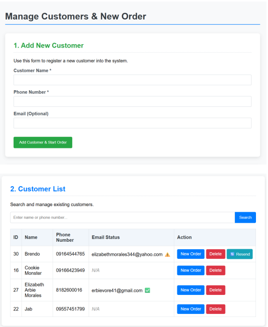

Detailed Order Creation & Washing Preferences

When creating orders, staff can select or search for existing customers by name or phone number. The order form captures essential details like weight (in lbs) and service type (Wash and Fold, Dry Cleaning, or Ironing Only). Additionally, staff can specify detailed washing preferences including detergent type (Standard, Hypoallergenic, Scented Deluxe), softener type (Standard, No Softener, Extra Scented), and starch level (None, Light, Medium, Heavy). Special instructions and defect logs can be added for each order, ensuring clear communication about customer preferences and pre-existing item conditions.

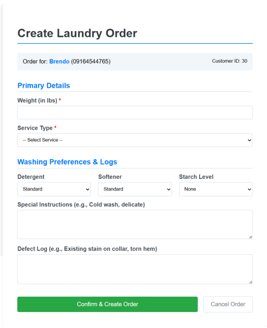

Intelligent Order Management & Tracking

The system provides a comprehensive order viewing interface where staff can search by order ID, customer name, or phone number. Filters allow narrowing results by month and year. Each order displays with color-coded status badges (Pending in yellow, Processing in teal, Ready for Pickup in green, Completed in gray). The interface handles deleted customer profiles gracefully by displaying "Deleted Customer" labels in red while preserving order history. Action buttons allow staff to manage orders (edit details), view summaries (detailed breakdown), or delete order history permanently.

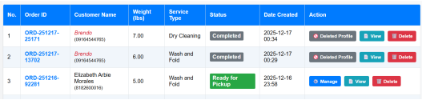

Dynamic Pricing Calculation System

The system features a sophisticated pricing engine that calculates order totals automatically based on configurable rates. Base pricing is calculated as weight × rate per pound, with service-specific surcharges added for Dry Cleaning or Ironing Only services. The system then applies the configured tax rate to the subtotal to produce the final amount. In the order editing interface, JavaScript provides real-time price updates as staff modify weight or service type values, allowing immediate visibility of cost changes before saving.

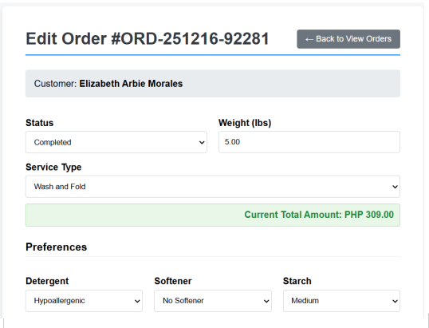

Comprehensive Order Summary & Receipt Generation

Order summary pages provide complete order details including customer information (with deleted profile indication if applicable), order specifics (service type, weight, status), washing preferences section showing all selected options, and financial breakdown table displaying rate per pound, quantity, individual line items, subtotal, tax, and final total in PHP currency format. From this summary, staff can generate printable receipts formatted in a compact receipt style suitable for thermal printers, displaying all order details, preferences, itemized pricing, and shop footer information.

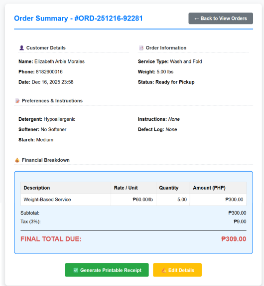
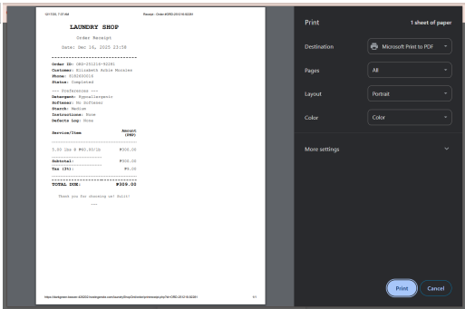
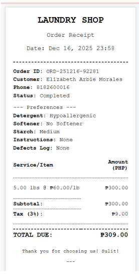

Email Notification System for Order Updates

The system integrates with PHPMailer to send automated email notifications to verified customers when their order status changes. When an order is updated to "Ready for Pickup" or "Completed", the system checks if the customer has a verified email address. If verified, it sends a professionally formatted HTML email with the order ID, new status, and relevant information. The email includes color-coded status displays and personalized messages. Staff receive confirmation when emails are sent successfully or warnings if delivery fails, providing transparency in the communication process.

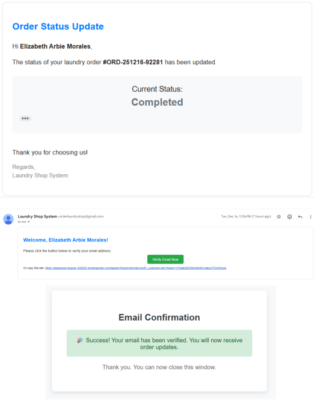

Admin Management Panel & User Control

Administrators have access to a dedicated user management interface where they can view all system users in a table format showing username, full name, email, role (Staff/Admin), and creation date. The system displays roles with color-coded badges (Admin in red, Staff in teal) for easy identification. Admins can create new users with the "Add New User" button, edit existing user details (except their own role to prevent privilege escalation), and delete users with safeguards preventing self-deletion and last admin deletion. The interface provides clear feedback messages for all operations.

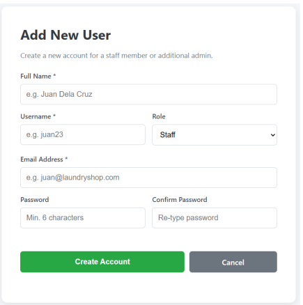

Centralized Pricing Configuration

Administrators can configure all pricing parameters from a dedicated pricing management page. The interface allows setting the base rate per pound for standard Wash and Fold service, defining flat-fee surcharges for Dry Cleaning and Ironing Only services, and configuring the tax rate percentage (stored as decimal but displayed as percentage for usability). Changes take effect immediately system-wide, and all existing orders retain their original pricing while new orders use the updated rates. The system validates all inputs to ensure positive values and proper number formatting.

Advanced Reports & Analytics Dashboard

The analytics dashboard provides comprehensive business intelligence through multiple visualizations and data tables. The top section displays KPI cards showing total completed orders, total revenue (all-time), and average order value with color-coded borders. Interactive bar charts visualize order volume and revenue trends with toggle buttons allowing staff to switch between daily and monthly views. A pie chart displays service type distribution with percentages. Detailed data tables below provide raw data for daily order counts, revenue breakdown by date, and service type analysis. The dashboard includes a print button that generates printer-friendly reports with proper page breaks and styling.

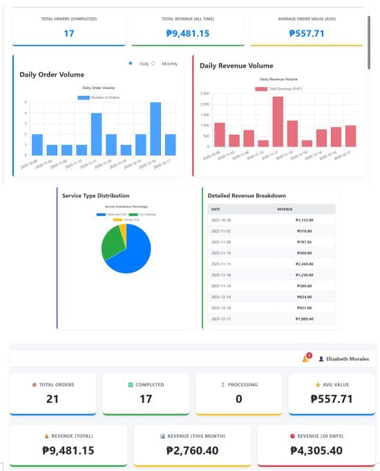

Smart Customer Deletion with Order History Preservation

The system handles customer profile deletions intelligently using a soft-delete approach. When a customer profile is deleted, the customer record is removed from the database, but all associated orders remain intact through the use of ON DELETE SET NULL foreign key constraints. The customer_id in orders is set to NULL, while snapshot data (stored in order_customer_snapshot table) preserves the customer's name and phone number at the time of order. In order listings, deleted customer profiles appear with special styling (red italic text) and a "(Profile Deleted)" indicator. Staff cannot edit orders for deleted customers but can still view summaries, generate receipts, and maintain complete order history for business records.

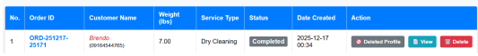

Real-Time Notification System for Staff

The system includes a topbar notification system that appears on all dashboard pages, displaying a bell icon with a red badge showing the count of unread notifications. Notifications are created automatically when customers verify their email addresses, informing staff that the customer can now receive order updates. Hovering over the bell icon reveals a dropdown menu showing recent notifications with titles, messages, timestamps, and type-specific color coding (green for success, yellow for warnings). Clicking a notification marks it as read and redirects staff to the relevant page (e.g., customer management filtered to show the verified customer). This keeps staff informed of important system events without requiring page refreshes.

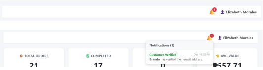

System Initialization & First-Time Setup

The system includes intelligent first-run detection that checks if any users exist in the database. When the system is accessed for the first time with zero users, it automatically redirects to a special setup page instead of the login screen. This setup page forces the creation of the first administrator account with the admin role locked (cannot be changed to staff). After successful setup, the system redirects to the login page with a success message confirming initialization. This ensures the system is always secure and cannot be accessed without proper authentication, while also providing a smooth onboarding experience for new installations.

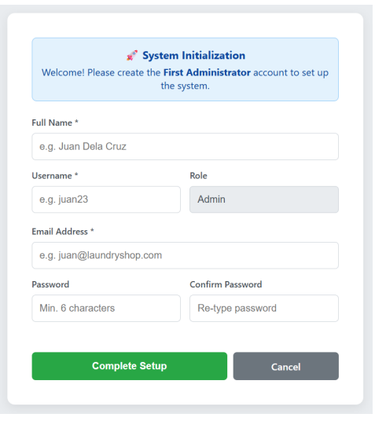

CREATE DATABASE `laundry_shop_db`;
USE `laundry_shop_db`;

CREATE TABLE `customer` (
  `id` int(11) NOT NULL,
  `name` varchar(255) NOT NULL,
  `phone_number` varchar(15) NOT NULL,
  `email` varchar(255) DEFAULT NULL,
  `email_verified_at` datetime DEFAULT NULL,
  `date_registered` datetime DEFAULT current_timestamp(),
  `is_active` tinyint(1) NOT NULL DEFAULT 1
) 

CREATE TABLE `email_verification_audit` (
  `id` int(11) NOT NULL,
  `customer_id` int(11) DEFAULT NULL,
  `event_type` varchar(50) NOT NULL,
  `token` varchar(255) DEFAULT NULL,
  `sent_to` varchar(255) DEFAULT NULL,
  `triggered_by` int(11) DEFAULT NULL,
  `ip_address` varchar(45) DEFAULT NULL,
  `notes` text DEFAULT NULL,
  `created_at` datetime DEFAULT current_timestamp()
);

CREATE TABLE `laundry_order` (
  `id` int(11) NOT NULL,
  `order_id` varchar(20) NOT NULL,
  `customer_id` int(11) DEFAULT NULL,
  `customer_name_at_order` varchar(255) DEFAULT NULL,
  `weight_lbs` decimal(5,2) NOT NULL,
  `service_type` varchar(50) NOT NULL,
  `status` varchar(50) DEFAULT 'Pending',
  `total_amount` decimal(10,2) DEFAULT 0.00,
  `date_created` datetime DEFAULT current_timestamp()
) ;

CREATE TABLE `notifications` (
  `id` int(11) NOT NULL,
  `recipient_type` varchar(20) NOT NULL DEFAULT 'user',
  `type` varchar(50) DEFAULT NULL,
  `title` varchar(255) DEFAULT NULL,
  `message` text DEFAULT NULL,
  `link` varchar(255) DEFAULT NULL,
  `is_read` tinyint(1) DEFAULT 0,
  `created_at` datetime DEFAULT current_timestamp()
);

CREATE TABLE `order_customer_snapshot` (
  `order_id` varchar(20) NOT NULL,
  `snapshot_name` varchar(255) NOT NULL,
  `snapshot_phone` varchar(20) NOT NULL
);

CREATE TABLE `order_details` (
  `order_id` varchar(20) NOT NULL,
  `detergent_type` varchar(50) DEFAULT 'Standard',
  `softener_type` varchar(50) DEFAULT 'Standard',
  `starch_level` varchar(20) DEFAULT 'None',
  `defect_log` text DEFAULT NULL,
  `special_instructions` text DEFAULT NULL
);

CREATE TABLE `pricing_settings` (
  `id` int(11) NOT NULL,
  `rate_per_lb` decimal(6,2) NOT NULL',
  `dry_cleaning_surcharge` decimal(6,2) NOT NULL',
  `ironing_only_surcharge` decimal(6,2) NOT NULL ',
  `tax_rate` decimal(3,2) NOT NULL DEFAULT 0.03 ',
  `last_updated` datetime DEFAULT current_timestamp() ON UPDATE current_timestamp()
);

CREATE TABLE `user` (
  `id` int(11) NOT NULL,
  `username` varchar(50) NOT NULL,
  `email` varchar(255) DEFAULT NULL,
  `password_hash` varchar(255) NOT NULL,
  `role` enum('admin','staff') NOT NULL DEFAULT 'staff',
  `name` varchar(255) NOT NULL,
  `date_created` datetime DEFAULT current_timestamp()
);

